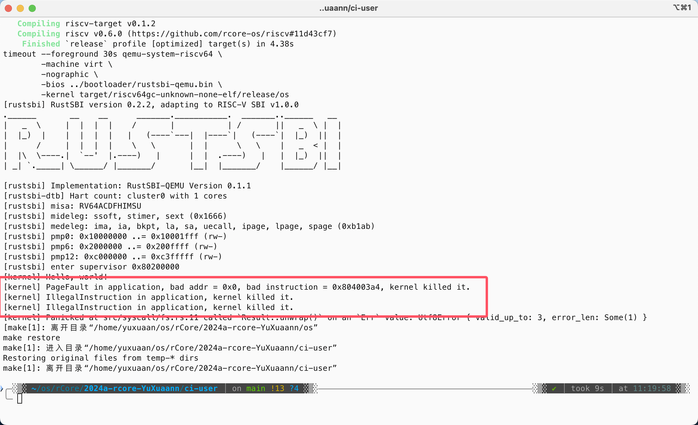

# 实现功能

## 统计时间

1. 开始：任务被创建时
2. 结束：sys_task_info函数被调用时

## 统计系统调用次数

调用时给数组+1即可

# 简答题

1. (RustSBI version 0.2.2, adapting to RISC-V SBI v1.0.0) 出错行为如下：

- 访问0地址触发 `store_fault`  
- 用户态使用特权态指令触发 `illegal_instruction`

2. 回答如下

    1. 刚进入 `__restore` 时，`a0` 代表了原 `task_cx`；`__restore` 的两种使用情景：`trap` 控制流返回、`__switch` 后调用 `__restore` 时返回 `U` 态
    2. `sstatus`、`sepc`、`sscratch`，这些寄存器保存了原 `task_cx` 的状态，`sstatus` 保存了 `sstatus::SPP` 位，`sepc` 保存了 `sret` 返回的地址，`sscratch` 保存了用户栈指针；这些都是为了返回用户态做准备，恢复原控制流状态
    3. `x2` 是 `sp` 寄存器，`x4` 是 `tp` 寄存器，前者在后面会被更改为指向用户栈，后者是线程指针，用不着
    4. `sp` 指向用户栈, `sscratch` 指向内核栈
    5. `sret` 指令
    6. `sp` 指向内核栈, `sscratch` 指向用户栈
    7. `ecall` 指令

# 荣誉准则

1. 在完成本次实验的过程（含此前学习的过程）中，我曾分别与**以下各位**就（与本次实验相关的）以下方面做过交流，还在代码中对应的位置以注释形式记录了具体的交流对象及内容：

无

2. 此外，我也参考了**以下资料**，还在代码中对应的位置以注释形式记录了具体的参考来源及内容：

[rCore-Camp-Guide-2024A](https://learningos.cn/rCore-Camp-Guide-2024A)

3. 我独立完成了本次实验除以上方面之外的所有工作，包括代码与文档。 我清楚地知道，从以上方面获得的信息在一定程度上降低了实验难度，可能会影响起评分。

4. 我从未使用过他人的代码，不管是原封不动地复制，还是经过了某些等价转换。 我未曾也不会向他人（含此后各届同学）复制或公开我的实验代码，我有义务妥善保管好它们。 我提交至本实验的评测系统的代码，均无意于破坏或妨碍任何计算机系统的正常运转。 我清楚地知道，以上情况均为本课程纪律所禁止，若违反，对应的实验成绩将按“-100”分计。

